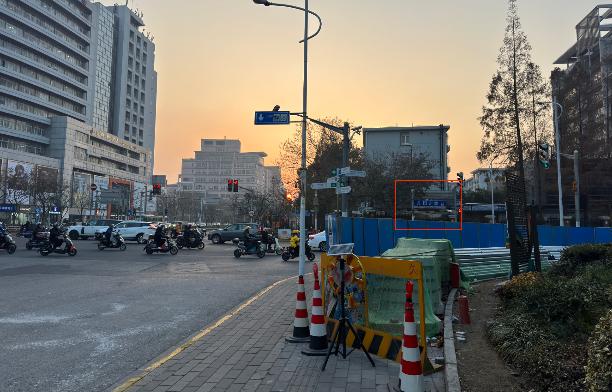
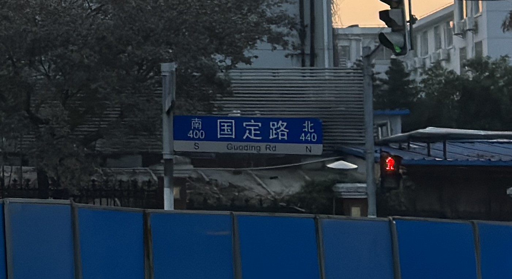

As for the problem you mentioned, the image shown above is a typical example of problems of this kind. As for the problem "Is this a sunset or a sunrise?", it can be inferred from the lower-right of the image.
In the lower-right:

There is a road sign:
<!--  -->

<image src="./inference.jpg" width=80%></image>

 there’s a road sign indicating "South" on the left and "North" on the right. This means the photographer is facing west, and since the sun sets in the west, this photo was taken during a sunset.

For cases like this in our benchmark, there is no need for additional continuous views to determine the answer. The correct answer can be obtained simply by applying active perception.

As for why this is active perception, imagine that if the initial scene given to the model is a photo of only the sun, the model needs to move its perspective to find relevant clues (in this scene, the road sign) to answer the corresponding question.